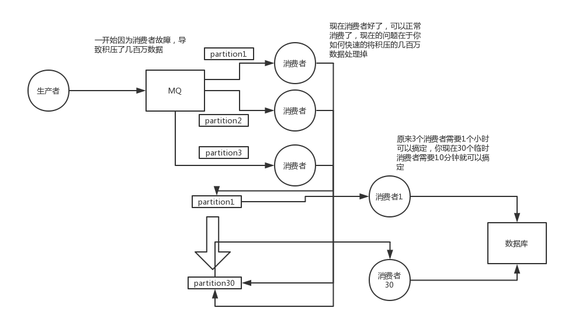

# 面试汇总3

（1）大量消息在mq里积压了几个小时了还没解决

几千万条数据在MQ里积压了七八个小时，从下午4点多，积压到了晚上很晚，10点多，11点多

这个是我们真实遇到过的一个场景，确实是线上故障了，这个时候要不然就是修复consumer的问题，让他恢复消费速度，然后傻傻的等待几个小时消费完毕。这个肯定不能在面试的时候说吧。

一个消费者一秒是1000条，一秒3个消费者是3000条，一分钟是18万条，1000多万条

所以如果你积压了几百万到上千万的数据，即使消费者恢复了，也需要大概1小时的时间才能恢复过来

一般这个时候，只能操作临时紧急扩容了，具体操作步骤和思路如下：

1）先修复consumer的问题，确保其恢复消费速度，然后将现有cnosumer都停掉

2）新建一个topic，partition是原来的10倍，临时建立好原先10倍或者20倍的queue数量

3）然后写一个临时的分发数据的consumer程序，这个程序部署上去消费积压的数据，消费之后不做耗时的处理，直接均匀轮询写入临时建立好的10倍数量的queue

4）接着临时征用10倍的机器来部署consumer，每一批consumer消费一个临时queue的数据

5）这种做法相当于是临时将queue资源和consumer资源扩大10倍，以正常的10倍速度来消费数据

6）等快速消费完积压数据之后，得恢复原先部署架构，重新用原先的consumer机器来消费消息

（2）这里我们假设再来第二个坑

假设你用的是rabbitmq，rabbitmq是可以设置过期时间的，就是TTL，如果消息在queue中积压超过一定的时间就会被rabbitmq给清理掉，这个数据就没了。那这就是第二个坑了。这就不是说数据会大量积压在mq里，而是大量的数据会直接搞丢。

这个情况下，就不是说要增加consumer消费积压的消息，因为实际上没啥积压，而是丢了大量的消息。我们可以采取一个方案，就是批量重导，这个我们之前线上也有类似的场景干过。就是大量积压的时候，我们当时就直接丢弃数据了，然后等过了高峰期以后，比如大家一起喝咖啡熬夜到晚上12点以后，用户都睡觉了。

这个时候我们就开始写程序，将丢失的那批数据，写个临时程序，一点一点的查出来，然后重新灌入mq里面去，把白天丢的数据给他补回来。也只能是这样了。

假设1万个订单积压在mq里面，没有处理，其中1000个订单都丢了，你只能手动写程序把那1000个订单给查出来，手动发到mq里去再补一次

（3）然后我们再来假设第三个坑

如果走的方式是消息积压在mq里，那么如果你很长时间都没处理掉，此时导致mq都快写满了，咋办？这个还有别的办法吗？没有，谁让你第一个方案执行的太慢了，你临时写程序，接入数据来消费，消费一个丢弃一个，都不要了，快速消费掉所有的消息。然后走第二个方案，到了晚上再补数据吧。

